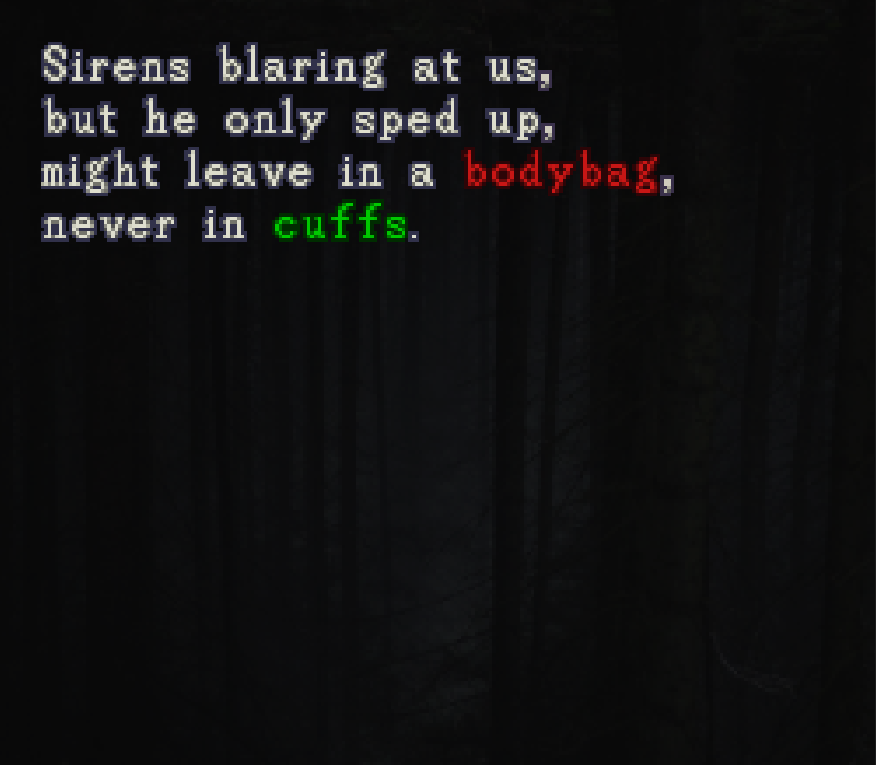
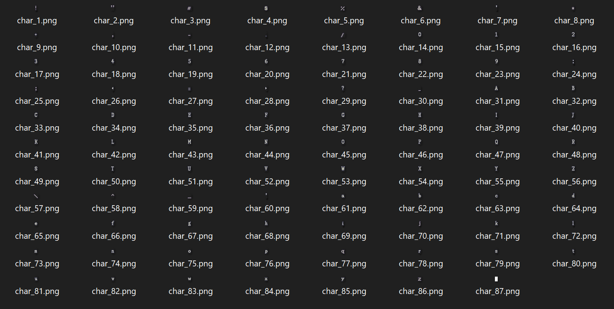
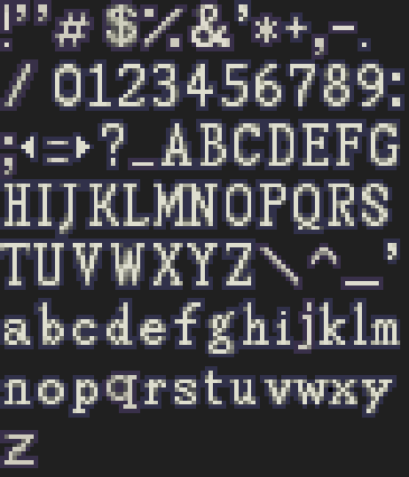

# OpenGL Text Blitter




Font sprite sheet packer/unpacker and text blitter implemented in OpenGL. Got it out the mud in both Debug/Release.

```
git clone https://github.com/livinamuk/GLText Blitter.git
```

This program reads in a folder of character images



and packs them into a sprite sheet



and produces a json file of character width/heights

```json
{
  "name": "StandardFont",
  "textureWidth": 96,
  "textureHeight": 112,
  "lineHeight": 14,
  "characters": "!\"#$%&'*+,-.\/0123456789:;<=>?_ABCDEFGHIJKLMNOPQRSTUVWXYZ\\^_`abcdefghijklmnopqrstuvwxyz ",
  "charDataList": [
    { "width": 3, "height": 13, "offsetX": 0, "offsetY": 0 },
    { "width": 9, "height": 14, "offsetX": 3, "offsetY": 0 },
    { "width": 12, "height": 13, "offsetX": 12, "offsetY": 0 },
    { "width": 9, "height": 12, "offsetX": 24, "offsetY": 0 },
    { "width": 11, "height": 12, "offsetX": 33, "offsetY": 0 },
    { "width": 11, "height": 13, "offsetX": 44, "offsetY": 0 },
    etc
```

The image names can be anything, but they're alphabetically sorted into the sprite sheet. 

#### Example usage ####

```cpp
void Init() {
    // Export
    std::string name = "StandardFont";
    std::string characters = R"(!"#$%&'*+,-./0123456789:;<=>?_ABCDEFGHIJKLMNOPQRSTUVWXYZ\^_`abcdefghijklmnopqrstuvwxyz )";
    std::string textureSourcePath = "res/fonts/raw_images/standard_font/";
    std::string outputPath = "res/fonts/";
    FontSpriteSheetPacker::Export(name, characters, textureSourcePath, outputPath);

    // Import
    FontSpriteSheet standardFont = FontSpriteSheetPacker::Import("res/fonts/StandardFont.json");
    AddFont(standardFont);
}

void Update() {
    int originX = 42;
    int originY = 42;
    float scale = 3.5f;
    std::string text = "Sirens blaring at us,\nbut he only sped up,\nmight leave in a [COL=0.9,0.1,0.1]bodybag[COL=1,1,1], \nnever in [COL=0,0.9,0]cuffs[COL=1,1,1].";
    TextBlitter::BlitText(text, "StandardFont", originX, originY, g_viewportWidth, g_viewportHeight, scale);
    TextBlitter::Update();
}
```

The color can be changed using the tag format `[COL=1,0,0]` for red, `[COL=0/5,0.5,0.5]` for grey, etc. See above.

See TextBlitter.cpp for the mesh generation and main.cpp for rendering

Never quit, never waver 🌹
